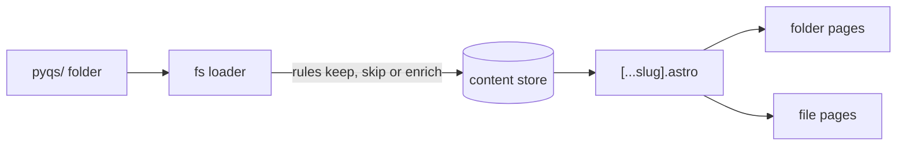
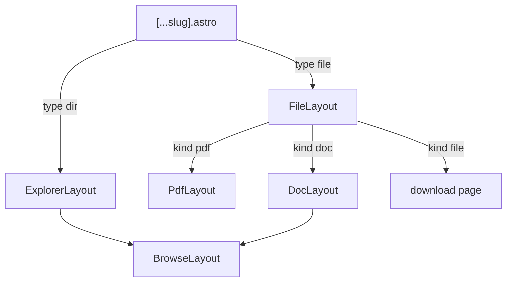

# Architecture

The site follows one idea: everything is a file. A content loader walks the papers folder, and every folder and file it keeps becomes a page. Folders list their contents, and files open in a viewer that depends on their kind.

## Build pipeline

1. `src/content.config.ts` defines one content collection, `fs`, backed by the `filesystemLoader` from `src/lib/content/loader.ts`.
2. The loader walks `pyqs/` and asks the rules in `src/lib/content/pyq-rules.ts` about each file. A rule returns the entry to store, possibly with extra data, or `null` to skip the file.
3. The loader validates every entry against the zod schema in `src/lib/content/schema.ts` and stores it with a digest of its data.
4. `src/pages/[...slug].astro` creates one page per stored entry.

## Content entries

Every entry has a `type` of `dir` or `file`, and a `path` that is also its URL, such as `/bca/sem 1/`.

| Field | On | Meaning |
| --- | --- | --- |
| `directories`, `files` | `dir` | The folder's children. Child folders are summaries without their own contents. |
| `kind` | `file` | How the file is listed and shown: `pdf`, `doc`, or `file` as the fallback |
| `pyq` | `file` | Details parsed from a paper's file name, such as subjects, exam type and year |
| `title` | `file` | A display name, taken from a markdown file's frontmatter |

The loader also:

- skips hidden files and folders, whose names start with a dot;
- renders a folder's `index.md` below its listing;
- leaves out folders with nothing kept inside them, except the root;
- deletes stale entries from the cached content store when files disappear;
- prints a summary of skipped files, grouped by extension, and of folders it left out.

## Pages

`BrowseLayout` is the shared frame for folder and doc pages. It shows an ad slot, the path crumbs and the page content. `ExplorerLayout` adds the entry list and the folder's `index.md`. `DocLayout` adds the rendered markdown.

`PdfLayout` uses `BaseLayout` without the header and footer. It embeds the [EmbedPDF](https://www.embedpdf.com/) viewer, which loads the PDF from `raw.githubusercontent.com`.

## Adding a file kind

File kinds keep the site open to new formats. To add one:

1. Add the kind to `FILE_KINDS` in `src/lib/content/schema.ts`.
2. Add a rule for its extension in `src/lib/content/pyq-rules.ts` that returns the entry with that `kind`.
3. Add a list item component in `src/components/widgets/explorer/` and render it in `EntryList.astro`.
4. Add a layout and a branch for the kind in `src/layouts/FileLayout.astro`.
5. Add tests for the rule in `tests/pyq-rules.test.ts`.

Office files are meant to be converted to PDF in the content repository's CI, so they reuse the PDF viewer instead of adding a kind.

## URLs

The site is served under the `/pyqs/` base path with trailing slashes. Two modules build URLs:

- `src/utils/url.ts` holds pure helpers such as `joinBase`, `githubRawUrl` and `uploaderUrl`. It has no `astro:*` imports, so the tests can import it.
- `src/utils/site-url.ts` binds those helpers to the Astro config. Use `addForwardSlashAndBaseUrl` for page links and `addBaseUrl` for assets.

Use the `NavLink` component for links. It adds the base path to site paths, and `target="_blank" rel="noopener"` to external links.

## Client-side behavior

The site uses Astro's `ClientRouter`, so page changes happen without full reloads.

- **Prefetching.** Links prefetch on hover by default. Folder and doc links prefetch when they scroll into view, because their pages are light. Chrome prerenders prefetched pages because of the `clientPrerender` flag.
- **Footer refresh.** Incremental builds can reuse a page's HTML from an older build. A script in `Footer.astro` fetches `/build-info.json`, which every build regenerates, and updates the build time and social links.
- **Ads.** An inline loader in `Head.astro` loads AdSense once per visit, on the first page whose `<meta name="ads">` is `on`, and fills ad slots on each page load. PDF pages set it to `off`.
- **Theme.** Starwind's theme script applies the stored or system theme before the page paints.

## Styling

Tailwind CSS 4 and [Starwind UI](https://starwind.dev) components. The Starwind CLI generates `src/components/starwind/`, `src/styles/starwind.css` and `src/lib/utils/starwind/`, so edit them through the CLI.

`src/styles/global.css` holds the site's own color tokens (`folder`, `pdf`, `doc`, `support`) and utilities for class combinations used in several places, such as `link-base` and `item-link`.
