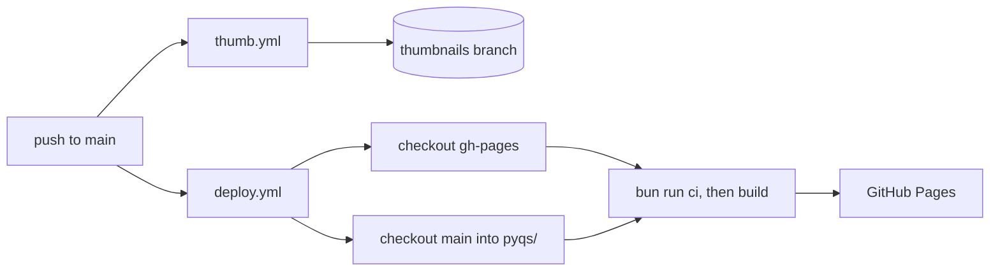

# Deployment

GitHub Pages hosts the site. The workflows live on the `main` branch in `.github/workflows/`, because each push of new papers should rebuild the site.

## deploy.yml

The workflow runs on every push to `main` and on manual runs from the Actions tab.

1. Check out `gh-pages` (the site) at the root, and `main` (the papers) into `pyqs/`.
2. Install dependencies with Bun and restore the build cache.
3. Run `bun run ci`: lint, tests and type checks. A failure stops the deploy.
4. Build with `bun run --bun build`.
5. Upload `dist/` and deploy it to GitHub Pages.

Pushes to `gh-pages` don't start a deploy. After changing the site, run the workflow manually or push to `main`.

## thumb.yml

The workflow renders a 512x512 WebP thumbnail of the first page of each new or changed PDF and commits it to the `thumbnails` branch. A manual run regenerates every thumbnail.

## Incremental builds

`experimental.incrementalBuild` in `astro.config.mjs` lets a build copy unchanged pages from the previous build instead of rendering them again.

Astro reuses a page when both of these match the previous build:

- the page's `cacheKey`, which `[...slug].astro` sets to the entry's digest from the loader;
- a hash of the route's code, including every component and stylesheet it imports.

Adding a paper re-renders its page and its folder's page. A code change re-renders every page that uses that code, and a change to `astro.config.mjs` or `bun.lock` re-renders everything.

The cache lives in `cache/astro/`. CI restores it with a key that changes on every run and falls back to the most recent cache, so each build saves a fresh copy. To ignore the cache, run `bun run astro build --force`.

Two things on each page change without a code or content change: the build time and the social links in the footer. The `/build-info.json` endpoint has no `cacheKey`, so every build regenerates it, and a footer script loads it to show current values.

## Configuration

`src/configs/site.config.ts` holds the site title, header and footer links, the GitHub repository and the branches for PDFs and thumbnails. `astro.config.mjs` sets the domain (`https://haldwani.gehu.in`) and the `/pyqs/` base path.

The build fetches the social links from [mglsj/socials](https://github.com/mglsj/socials). If that fetch fails, the footer shows no social links.
